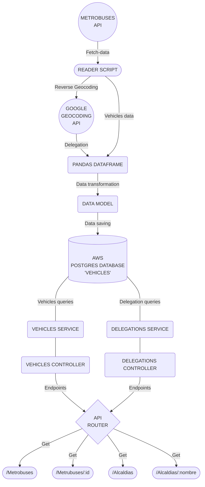
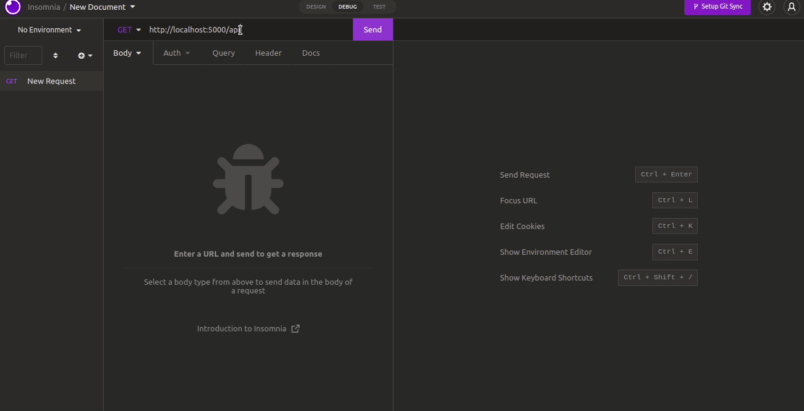
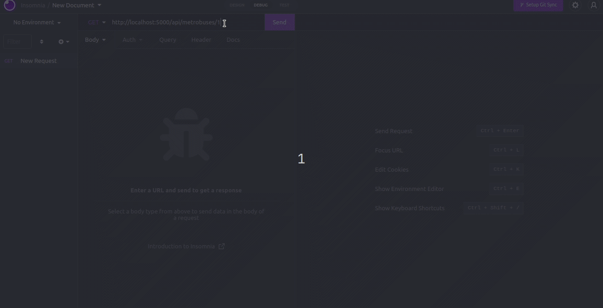
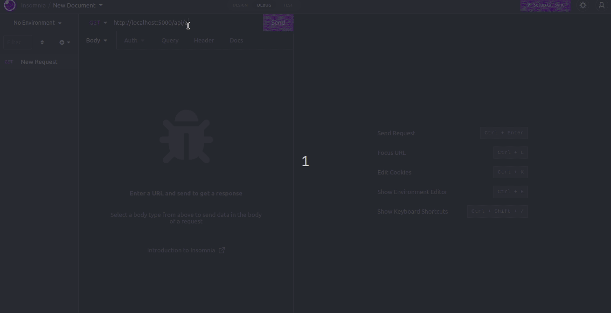
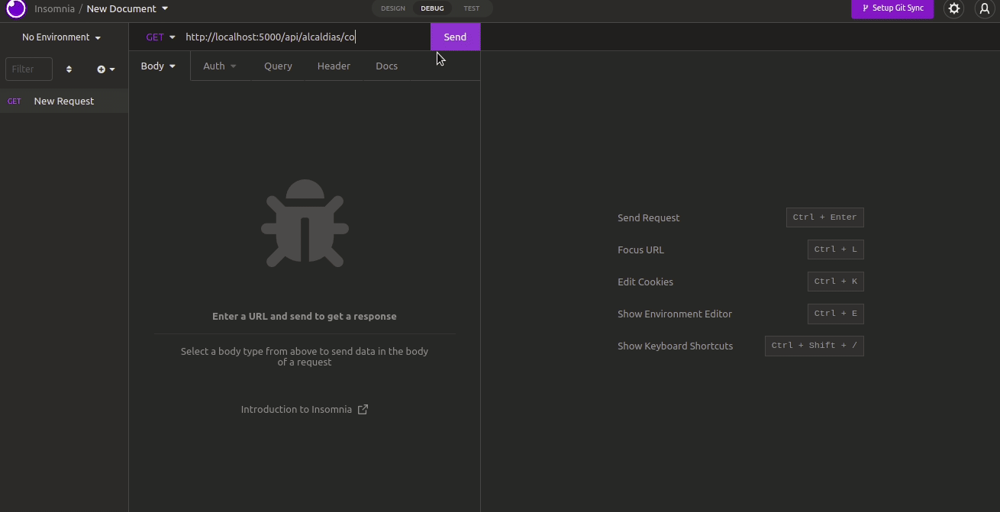

# **Data pipeline :star2:**

*Proyecto de pipeline de datos para obtener datos autobuses de cdmx y exponerlos en una API rest* :man_technologist:

---
## Contenido
* [Descripción y Requerimientos](#id0)
* [Diseño del Proyecto](#id1)
  * [Stack y Dependencias](#id1.1)
  * [Diagrama de Solución](#id1.2)
  * [Modelo de Datos](#id1.3)
  * [DDL](#id1.4)
* [Setup](#id2)
* [Previsualización](#id3)
---

## Descripción :pencil:<a id="id0"></a>

<p>
Se solicitó desarrollar un pipeline de análisis de datos utilizando los datos abiertos de la Ciudad de México
correspondientes a las ubicaciones de las unidades del metrobús para que pueda ser
consultado mediante un API Rest filtrando por unidad o por alcaldía con las siguientes consideraciones:
</p>

* Presentar un diagrama con el diseño de su solución.
* Generar un modelo de datos y su DDL.
* Obtener la alcaldía correspondiente a cada posición.
* Almacenar la información en una base de datos.
* Diseñar e implementar un API que permita consultar la información almacenada:
  * *Obtener una lista de unidades disponibles.*
  * *Consultar la ubicación de una unidad dado su ID.*
  * *Obtener una lista de alcaldías disponibles.*
  * *Obtener la lista de unidades que se encuentren dentro de una alcaldía.*

---

## Diseño del Proyecto :art:<a id="id1"></a>

Para la solución del problema se diseñó del flujo de datos obteniendo primero los datos en formato JSON desde la API para despues transformarlos a un dataframe con las columnas y datos adecuados para insertarse en una base de datos.

Se uso programación funcional, tratando de usar funciones puras que retornen siempre los mismos outputs, eliminando variables globales y evitando la mutación de los datos.

El proyecto se dividio en dos directorios principales: `/api`: contiene la API, `/data`: la logica del flujo de datos.

```PYTHON
│ # Root
└── Src
    ├── Api
    │   ├── app.py           # Main file: starts server
    │   ├── Routes           # API endpoints
    │   ├── Controllers      # Requests control
    │   ├── Models           # Data model definition
    │   ├── Services         # Access to data
    │   └── Database         # Database connection
    ├── Data 
    │   ├── Resources        # Contain the script to collect data             
    │   ├── Transformations  # Here is the code to create the dataframe and clean the data
    │   ├── Jobs             # Module to save the data into the database
    │   └── Scripts          # Bash script to execute the tasks (create table, get data and start the server)
    └──
```
Se creo un contenedor con docker para el servidor de la API Flask y se uso una base de datos relacional en la nube de AWS para la persistencia de los datos.

<br>

**Stack y dependencias** <a id="id1.1"></a>
* *[Python](https://nodejs.org/en/)*
* *[PostgreSQL](https://www.postgresql.org/)*
* *[Flask](https://flask.palletsprojects.com/en/2.1.x/)*
* *[Docker y docker compose](https://www.docker.com/)*
* *[Requests](https://requests.readthedocs.io/en/latest/)*
* *[Pandas](https://pandas.pydata.org/)*
* *[Psycopg2](https://www.psycopg.org/docs/)*
* *[Sqlalchemy](https://www.sqlalchemy.org/)*
* *[Google geocoder](https://developers.google.com/maps/documentation/geocoding/overview)*
* *[Unidecode](https://pypi.org/project/Unidecode/)*

<br>

**Diagrama de Solución** <a id="id1.2"></a>


<br>

<br>

**Modelo de Datos** <a id="id1.3"></a>

Se diseño el siguiente modelo de datos:

VEHICLE
| Field                      | DataType                 |
| ---------------------------|--------------------------|
| id                         | Primary Key              |
| date_updated               | Varchar(22)              |
| vehicle_id                 | SmallInt                 |
| vehicle_label              | SmallInt                 |
| vehicle_current_status     | Varchar(2)               |
| position_latitude          | Float                    |
| position_longitude         | Float                    |
| geographic_point           | Varchar(40)              |
| position_speed             | SmallInt                 |
| position_odometer          | SmallInt                 |
| trip_schedule_relationship | SmallInt                 |
| trip_id                    | Integer                  |
| trip_start_date            | Integer                  |
| trip_route_id              | SmallInt                 |
| delegation                 | Varchar(30)              |
| created_at                 | Timestamp                |


<br><br>

**Data Definition Language** <a id="id1.4"></a>
```SQL
CREATE TABLE IF NOT EXISTS vehicles (
    id SERIAL PRIMARY KEY ,
    date_updated VARCHAR(22) NOT NULL,
    vehicle_id SMALLINT NOT NULL,
    vehicle_label SMALLINT NOT NULL,
    vehicle_current_status VARCHAR(2) NOT NULL,
    position_latitude FLOAT NOT NULL DEFAULT 0,
    position_longitude FLOAT NOT NULL DEFAULT 0,
    geographic_point VARCHAR(40) NOT NULL,
    position_speed SMALLINT NOT NULL,
    position_odometer SMALLINT NOT NULL,
    trip_schedule_relationship SMALLINT NOT NULL,
    trip_id INTEGER DEFAULT 0,
    trip_start_date INTEGER DEFAULT 0,
    trip_route_id SMALLINT DEFAULT 0,
    delegation VARCHAR(30) NULL,
    created_at TIMESTAMP NOT NULL DEFAULT CURRENT_TIMESTAMP);
```

<br>

---

## Instalacion y Ejecución :wrench:<a id="id2"></a>

Para desplegar el servicio se requiere unicamente contar con docker y docker compose y ejecutar la siguiente serie de pasos:


```bash

  # Clona el repositorio
  git clone git@github.com:FabianGarciaXY/data_pipeline_.git

  # Ejecución
  cd data_pipeline_/ && docker compose up
  
```

<br>

**Endpoints:**

<br>

|            Endpoint                    |        Request      |       Response                                    | Ejemplo                               |
| ---------------------------------------|:-------------------:|:-------------------------------------------------:|:-------------------------------------:|
| `localhost:5000/api/metrobuses`        |         GET         | Todas las unidades disponibles                    | `localhost:5000/api/metrobuses`       |
| `localhost:5000/api/metrobuses/:id`    |         GET         | Un vehiculo filtrado por id                       | `localhost:5000/api/metrobuses/3`     |
| `localhost:5000/api/alcaldias`         |         GET         | Una lista de las alcaldías disponibles            | `localhost:5000/api/alcaldias`        |
| `localhost:5000/api/alcaldias/:nombre` |         GET         | Una lista de las unidades disponibles por alcaldía| `localhost:5000/api/alcaldias/tlalpan`|


<br>

---

## Previsualización :computer:<a id="id3"></a>

<br>

`Obtener una lista de unidades disponibles`:



<br><br>

`Consultar la ubicación de una unidad dado su ID`:



<br><br>

`Obtener una lista de alcaldías disponibles`:



<br><br>

`Obtener la lista de unidades que se encuentren dentro de una alcaldía`:



<br><br>

---

<br><br>

Gracias
